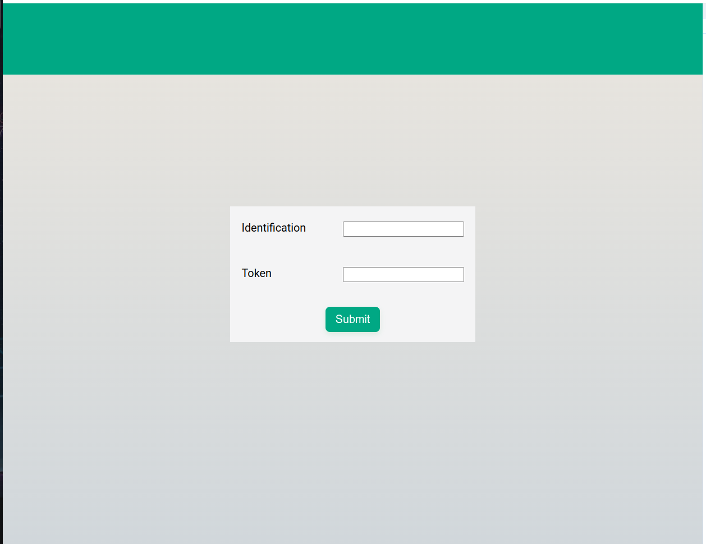
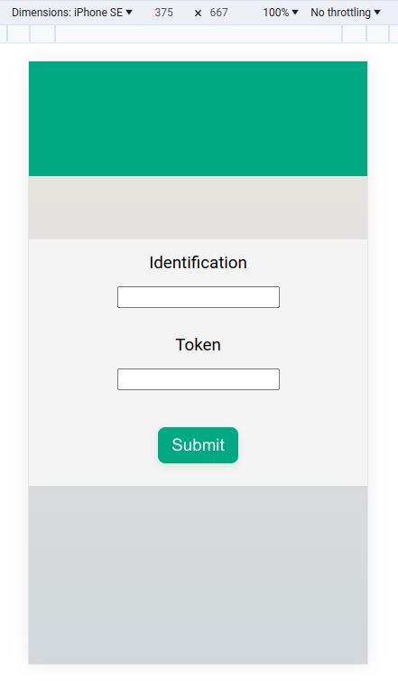
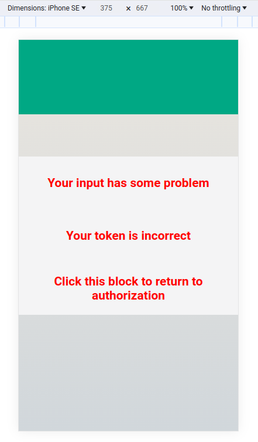
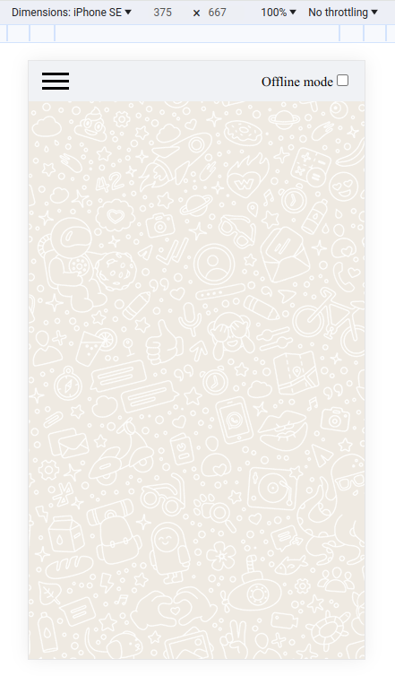
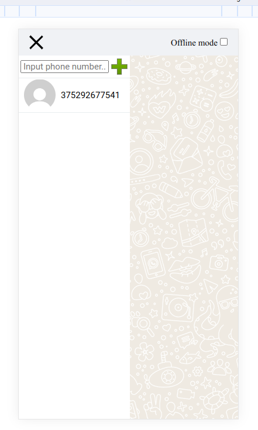
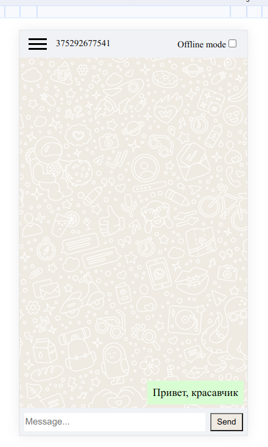
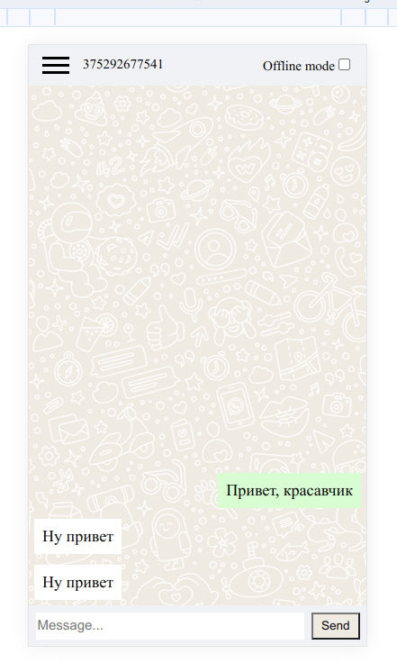

# Тестовое задание Whatsapp Чат

## Важно!

Для работы используется Green Api, позволяющий взаимодействовать с Whatsapp аккаунтом.
Перед этим нужно зарегистрироваться и создать инстанс на самом сайте: https://green-api.com/docs/before-start/
Для тестов могу предложить свой инстанс, однако помните!!!: все сообщения, отправленные с помощью моих данных,
будут видны мной лично в дальнейшем!  
Инстанс: 7103887540  
Токен: e41f096ad7474e999e08dbb6ec82ba35088eeb4259274130a9

## Функционал

Пользователь вписывает свои Green Api данные (id и token). 
Далее пользователь может добавить контакт для обмена сообщениями. 
Если контакт имеет Whatsapp, контакт будет создан.
Если имеется аватарка, она будет отображена. Если контакт имеет имя, оно будет отображено.
Далее отправляются сообщения. Реализованы как отправка, так и получение. Частично реализован оффлайн режим.
Отправленные в оффлайн режиме сообщения будут сохранены и после отключения оффлайн режима - отправлены.
Можно создать несколько чатов и общаться отдельно с каждым пользователем. Реализован перехват ошибок.
Работа, конечно, далека от идеала, функционал немного куц, 
а оффлайн режим недоработан, но что успел переделать за неделю - сделал.
Это моя старая тестовая работа, которую я переделывал эту неделю, так как она идеальна подходила требованиям.
Если нужно, есть несколько других моих работ, уже с другими технологиями, репозитории:  
https://github.com/foxnorth228/NoteManager  
https://github.com/foxnorth228/portfolio  
https://github.com/foxnorth228/christmas-task  


## Команды

```npm install``` - команда установки зависимостей

```npm run build``` - команда сборки проекта в папку public

```npm run dev``` - команда для запуска dev сервера

```npm run lint``` - команда для проверки синтаксиса (eslint)

```npm run lint:fix``` - команда для проверкии исправления синтаксиса (eslint)

## Деплой

[Деплой на Netlify](https://master--thunderous-pothos-af6dd7.netlify.app/)

##  Стек

* Typescript
* React (React hooks)
* Reduxjs/toolkit
* SCSS
* Babel, Eslint + prettier
* Сборка с помощью webpack
* Менеджер пакетов npm

## Файловая структура

* components - папка с основными компонентами
* config - папка с глобальными статическими данными
* hooks - папка с пользовательскими хуками
* pages - папка со страницами.
* routes - папка с данными для React Router
* services - папка для работы с Green Api
* store - папка с хранилищем Redux

## Структура компонента

* index - основной файл компонента
* style - файл со стилями
* types - файл с типаи данных typescript
* config - файл с локальными статическими данными

## Именование

- Названия компонентов и их папок: PascalCase
- Название файлов: camelCase
- Остальные переменные: camelCase
- Интерфейсы всегда начинаются с заглавной I, PascalCase

## Скриншоты







  
p.s. два сообщения не баг, у меня просто ватсап на телефоне залагал, и я два сообщения отправил
## Остальное

Протестировано с помощью PageSpeed Insights.  
Для импортирования используются aliases.

